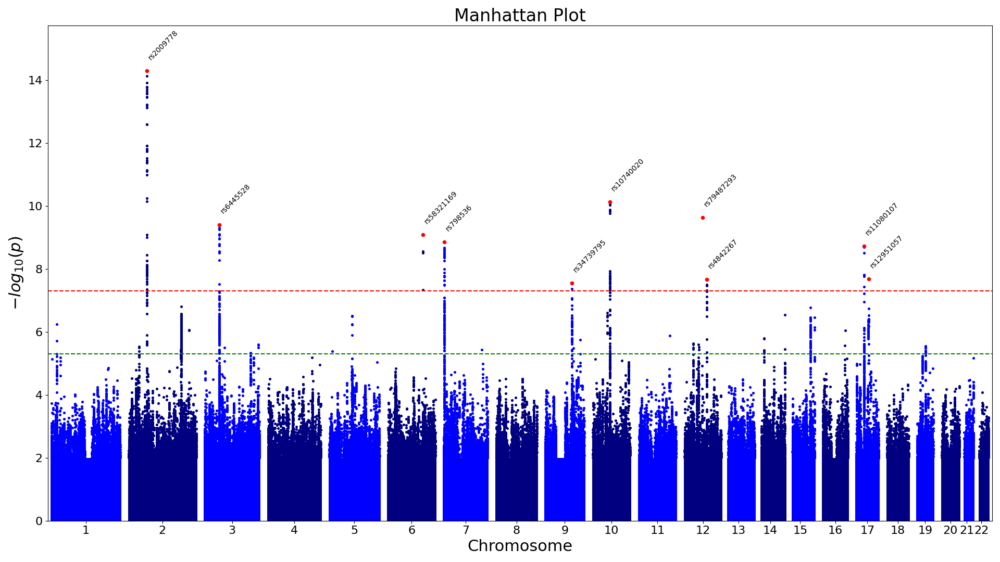
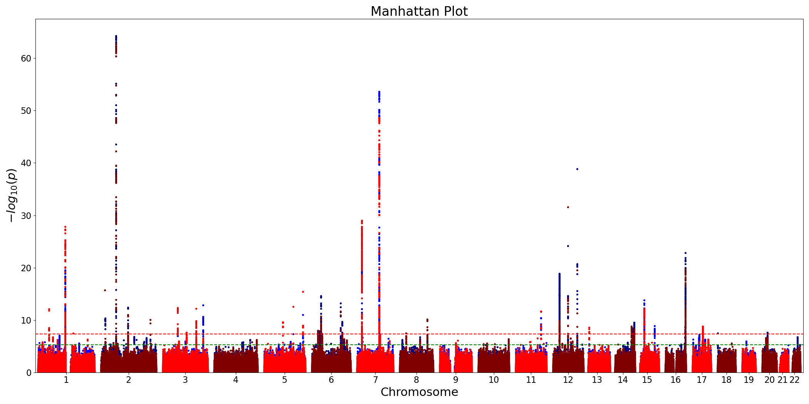
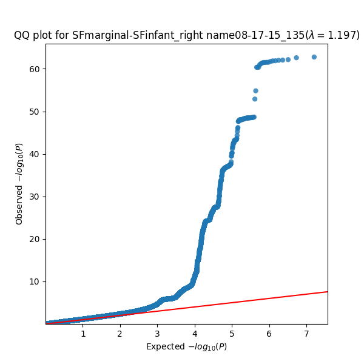

# postgwas-tools — Workflows

This document provides hands-on examples of how to use the tools included in the `postgwas-tools` package.

---

## Identify Lead SNPs (FUMA like, with PLINK1.9)

```bash
PLINK=/app/plink

leadSNP --sumstats /data/gwas.sumstats \
        --col-a1 A1 --col-a2 A2 \
        --bfile filt_imputed_autosomes_maf-0.01 \
        --plink $PLINK \
        --out results
```

This command extracts **independent lead SNPs** using FUMA-like logic and produces four files:
`GenomicRiskLoci.txt`, `leadSNPs.txt`, `IndSigSNPs.txt`, and `params.config`.
The first three files follow the same structure as those generated by FUMA.

Internally, the tool runs two PLINK 1.9 commands in sequence.
### Step 1 – Identify Independent Significant SNPs
```bash
plink --bfile filt_imputed_autosomes_maf-0.01 \
      --clump correct_format_gwas.sumstats \
      --clump-p1 5e-08 \
      --clump-p2 5e-06 \
      --clump-r2 0.6 \
      --clump-kb 1000 \
      --out FUMA/clump_ind
```
This command uses the binary genotype files (`.bed`, `.bim`, `.fam`) from `--bfile` filt_imputed_autosomes_maf-0.01 to calculate linkage disequilibrium (LD) within the sample.
It then **clumps** SNPs from the summary statistics file (`--clump`) as follows:

* Only SNPs with **p-values < 5e-8** (`--clump-p1`) are considered significant.
* SNPs with **p-values < 5e-6** (`--clump-p2`) can be included in clumps.
* SNPs are grouped if **r² ≥ 0.6** (`--clump-r2`), and clumps span at most **1 Mb** (`--clump-kb` 1000).
* Results are stored temporarily in `FUMA/clump_ind`.


Note: FUMA limits clump size by the number of SNPs rather than physical distance;
this implementation differs slightly by limiting by base-pair window size (1 Mb).

### Step 2 – Identify Lead SNPs
```bash
plink --bfile filt_imputed_autosomes_maf-0.01 \
      --clump correct_format_gwas.sumstats \
      --clump-p1 5e-08 \
      --clump-p2 5e-06 \
      --clump-r2 0.1 \
      --clump-kb 1000 \
      --out FUMA/clump_lead
```

This second clumping step repeats the previous logic, except that **r² = 0.1** is used to identify **lead SNPs**.

The output is stored temporarily in `FUMA/clump_lead`.

### Step 3 – Merge clumps

Finally, clumps whose lead SNPs are located within **250 kb** of each other are merged into **genomic loci**.

---

## Fast Manhattan Plot

The **fast Manhattan plot** reduces plotting time by skipping points with p-values above `1e-2`.
Instead of plotting each SNP individually, it draws **rectangles** for each chromosome with:

* **Length** = (last bp position − first bp position)
* **Height** = from 0 to −log₁₀(1e-2)

Annotations from the previous step (e.g., lead SNP names) can be added.
Both `GenomicRiskLoci.txt` and `leadSNPs.txt` are supported.

```bash
light_manhattan_plot -p /data/gwas.sumstats \
                     --lead-snps GenomicRiskLoci.txt \
                     -o results
```

**Example output:**



---

## Multi-Model Manhattan Plot

If you want to plot many results on a same figure to compare different phenotypes, you can.
Generate a combined Manhattan plot for multiple GWAS result files:

```bash
manhattan_plot -p /data/gwas1.sumstats /data/gwas2.sumstats /data/gwas3.sumstats \
               -t manhattan \
               -o results
```

Alternatively, you can use a wildcard:
```bash
manhattan_plot -p "/data/*.sumstats" \
               -t manhattan \
               -o results
```

**Example output:**



---

## QQ Plot

Use this command to check GWAS inflation.
Based on code from [ShujiaHuang/qmplot](https://github.com/ShujiaHuang/qmplot):

```bash
QQ_plot -p /data/gwas.sumstats \
        -o results
```



---

## Replication Check by rsID
This tool extracts rows from the replication summary statistics file (`--sumstats`) that correspond to the **lead SNPs** representing genomic loci in the `GenomicRiskLoci.txt` file.  
It matches SNPs based on the `rsID` column.

It can take either `leadSNPs.txt` **or** `GenomicRiskLoci.txt` as input for the `--lead-snps` argument.

```bash
replication_by_rsid \
        --lead-snps GenomicRiskLoci.txt \
        --sumstats /data/replication.sumstats \
        --out replication_results
```
**Example output:**

| CHR | SNP        | BP        | A1 | A2 | PVAL                 | Z_FAKE             | N      |
| --- | ---------- | --------- | -- | -- | -------------------- | ------------------ | ------ |
| 1   | rs12408663 | 19641564  | C  | T  | 0.1722612687472529   | 1.3649738512483902 | 9950.0 |
| 2   | rs6546175  | 65749771  | C  | T  | 0.42544035829526683  | 0.797018377419405  | 9950.0 |
| 3   | rs6778735  | 52531084  | C  | T  | 0.3536629004493488   | 0.9275078836756854 | 9950.0 |
| 6   | rs58321169 | 126547421 | T  | C  | 0.002508548341954122 | 3.0223083972754567 | 9950.0 |

---

## LDSC Results Extraction

This section explains how to extract **heritability estimates** and **genetic correlations** from LDSC (Linkage Disequilibrium Score Regression) results.


To extract SNP-based heritability estimates from `.log` files generated by LDSC and save them to a `.tsv` table:
```bash
extract_h2 -p ldsc/h2/*.log \
           -o results
```

**Example output (`h2_summary.tsv`):**

| pheno | h2     | se     | lambdaGC | Mean_Chi2 | Intercept |
| ----- | ------ | ------ | -------- | --------- | --------- |
| dim18 | 0.1414 | 0.0161 | 1.0895   | 1.1062    | 1.0061    |
| dim13 | 0.1087 | 0.0156 | 1.0649   | 1.0810    | 1.0048    |
| dim15 | 0.0716 | 0.0154 | 1.0496   | 1.0605    | 1.0105    |


```bash
extract_gencorr -p ldsc/SCZcorr/*.log \
                -o results
```

```bash
mahalanobis_gencorr --folder ldsc/SCZcorr \
                    --prefix scz_ \ 
                    --multphen initial_multphen.csv \
                    --out ldsc/SCZcorr
```

**Example output:**

```
Loading Z-scores...
Found 32 phenotypes:
 ['dim1', 'dim10', 'dim11', ..., 'dim32']
Computing phenotype correlation...
Performing Mahalanobis test...

=== Meta LDSC Mahalanobis Test ===
Chi² statistic = 110.4389
Degrees of freedom = 32
P-value = 1.47e-10
```

---

## Notes

- All manhattan plots are saved as `.png` files with **transparent backgrounds** for easy embedding.  
- Works with both `.sumstats` and compressed `.gz` files.  
- Regex paths and file lists are both supported.

---

## Back to Overview

Return to the main [README.md](README.md).